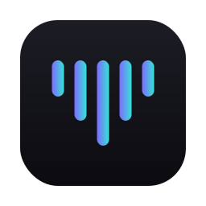
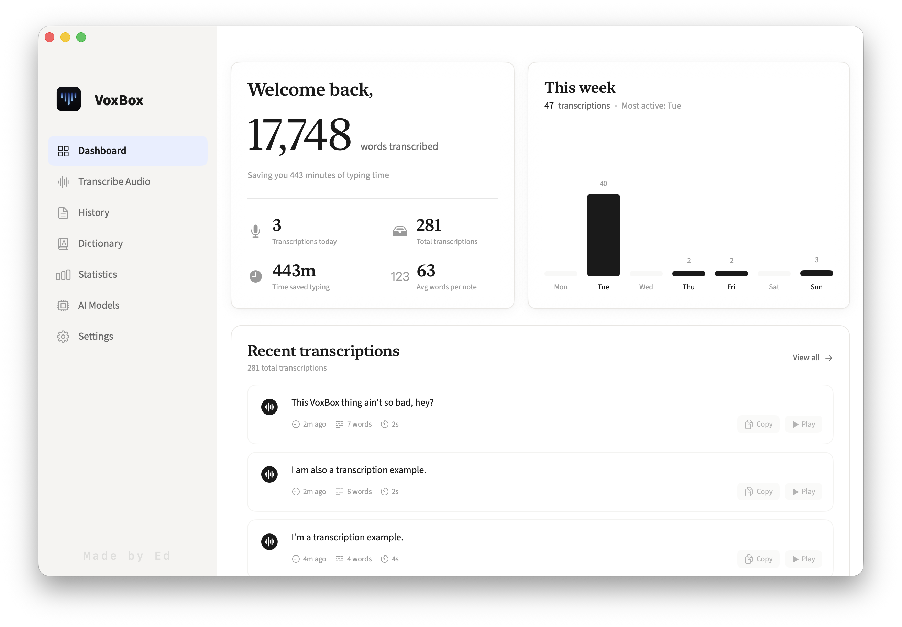

# VoxBox

<div align="center">



**Fast, Offline Voice-to-Text for macOS**



[](https://github.com/edl-bb/VoxBox/releases/latest)
[](https://swift.org)
[](https://www.apple.com/macos/)
[](LICENSE)

*Press a hotkey, speak, and paste text anywhere on your Mac.*

</div>

---

## What is VoxBox?

VoxBox is a privacy-first dictation app for macOS. Speech is transcribed **on your Mac** using native MacOS models. Customise your preferred model and use [WhisperKit](https://github.com/argmaxinc/WhisperKit) or Parakeet if you prefer. 

No transcription data is sent off the device to a cloud provider. Your data remains safe on your device.

- **Private** — transcription and cleanup stay on the device
- **Local models** — choose your preferred transcription model and use it offline. Optional text cleanup utilises on device Apple Intelligence models.
- **Works anywhere** — use VoxBox with any app or website.

---

## On-device cleanup

Raw speech-to-text gets messy on longer takes: fillers, false starts, missing punctuation. VoxBox can run an optional **on-device Apple Intelligence** pass after the speech model (so nothing leaves your Mac):

- **Basic** — capitals, commas, paragraph breaks only
- **Light cleanup** — also drops fillers and fixes obvious grammar
- **Polish** — smooths choppy dictation into fluent sentences
- **Custom** – [New in v1.2.0]: create your own instructions for the LLM, so you can run the cleanup your way.

Instant, non-AI options are also available to strip "um's" and "ahh's" if you want the fastest experience possible.

Cleanup runs on the Apple Intelligence model built into macOS 26. Support for other on-device models is planned once macOS 27's native model support ships.

---

## VoxBox quality of life improvements

- **Delivery** — choose how the transcript is delivered:
  - **Copy transcription to clipboard** — copy the completed transcript to your clipboard to use when you're ready
  - **Auto paste transcription** — default; when you finish recording, write transcript to a waiting text box. Falls back to clipboard if no writable text area is found.
  - **Stream transcription** — words appear as you speak them. Falls back to Auto paste/clipboard if no writable text area is found.
- **Copy last transcript** — ⌃⌥C to put the most recent transcript on the clipboard (configurable shortcut)
- **Australian English** — support for Australian English spelling
- **Custom hotkey** — use the key combination you prefer to invoke VoxBox
- **Retention** — auto-delete audio and old transcripts; usage stats are retained
- **Model download progress** – improved visibility when models are downloading in the background so you know how long you need to wait to begin transcribing.
- **Local LLM post-processing** — use the on-device Apple Intelligence LLM to clean up the transcript

---

## Install

**Requires** macOS 26+, Apple Silicon recommended, and at least 2GB for models.

1. [Download the latest `VoxBox.dmg`](https://github.com/edl-bb/VoxBox/releases/latest)
2. Drag **VoxBox** to **Applications**
3. Grant **Microphone** (required) and **Accessibility** (for auto-paste)
4. Download a model from the **AI Models** screen

Press `fn` to dictate (or set your own shortcut in Settings).

### Build from source
```bash
git clone https://github.com/edl-bb/VoxBox.git
cd VoxBox
make build && make run
```

---

## Usage

1. Press the hotkey
2. Speak — a sentence or a longer note
3. Release (or press again in toggle mode)
4. Transcript appears, ready for what comes next.


The first model load for a newly downloaded model can take 30–60 seconds. After that, dictation is fast.

---

## License

MIT — see [LICENSE](LICENSE).

VoxBox is based on **[SpeakType](https://github.com/karansinghgit/speaktype)** by **Karan Singh** (2048 Labs). Whisper via [WhisperKit](https://github.com/argmaxinc/WhisperKit) / [OpenAI Whisper](https://github.com/openai/whisper).
